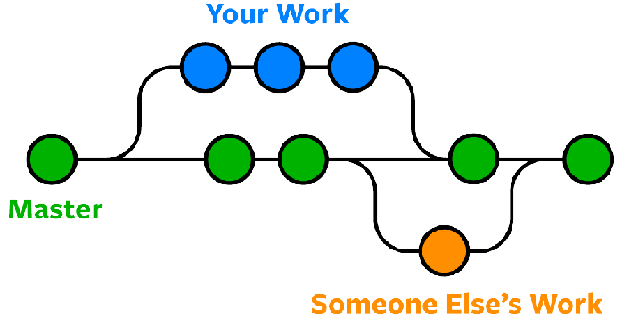

<link rel="stylesheet" href="./style.css">

Demo how to use basic GitHub commands..

<body>
<h1><a class="title" href="https://www.github.com">GitHub</a> commands</h1>

<ol>
    <h2>The most used commands</h2>

<li>
    <strong><h4>What is my actual branch ?</h4></strong>
    

        
<strong>Command: </strong><i class="colored">git </i>branch

    

</li>

<li>
    <strong><h4>What is actual status of changes ?</h4></strong>
    

        
<strong>Command: </strong><i class="colored">git </i>status

    

</li>

<li>
    <strong><h4>How to change repository ?</h4></strong>
    

        
<strong>Command: </strong><i class="colored">git </i>checkout other_branch_name

    

</li>

<li>
    <strong><h4>How to pull changes from another branch ?</h4></strong>
    

        
<strong>Command: </strong><i class="colored">git </i>pull origin another_branch_name

    

</li>

<li>
    <strong><h4>How to stage all changes ?</h4></strong>
    

        
<strong>Command: </strong><i class="colored">git </i>add .

    

</li>

<li>
    <strong><h4>How to create commit ?</h4></strong>
    

        
<strong>Command: </strong><i class="colored">git </i>commit -m "Your message"

    

</li>

<li>
    <strong><h4>How to push changes to github ?</h4></strong>
    

        
<strong>Command: </strong><i class="colored">git </i>push

    

</li>

<li>
    <strong><h4>How to pull changes from general development branch "dev" to your local development branch "local" ?</h4></strong>
    

        
<strong>Command: </strong><i class="colored">git </i>checkout dev

        
<strong>Command: </strong><i class="colored">git </i>status

        (should return "Working tree clean")
        
<strong>Command: </strong><i class="colored">git </i>pull

        
<strong>Command: </strong><i class="colored">git </i>checkout local

        
<strong>Command: </strong><i class="colored">git </i>merge dev

        (If some conflicts occurs you can use "git mergetool" command)
        
<strong>Command: </strong><i class="colored">git </i>commit -m "commit message"

        
<strong>Command: </strong><i class="colored">git </i>push

    

</li>

<h2>Basics</h2>

<!-- 1 -->
<li>
    <strong><h4>Adding the origin of REPO</h4></strong>
    

        
<strong>Command: </strong><i class="colored">git </i>remote add origin git@blabla/blabla

        <q>remote - refers to some cloud outside of your PC</q>
        <q>add origin - after these origin of REPO should be pasted</q>
    

</li>

<!-- 2 -->
<li>
    <strong><h4>Status of individual changes in main folder</h4></strong>
    

        
<strong>Command: </strong><i class="colored"> git </i>status

    

</li>

<!-- 3 -->
<li>
    <strong><h4>How to show all changes since the last commit ?</h4></strong>
    

        
<strong>Command: </strong><i class="colored">git </i>diff

    

</li>

<!-- 4 -->
<li>
    <strong><h4>Commit changes in files</h4></strong>
    

        
<strong>Command: </strong><i class="colored"> git </i>commit -m

        <q>-m states for message related to a given commit</q>
    

</li>

<!-- 5 -->
<li>
    <strong><h4>Pushing the changes to github repository</h4></strong>
    

        
<strong>Command: </strong><i class="colored">git </i>push origin branch

        <q>origin - relates to given origin of your Github account</q>
        <q>branch - relates to given branch in your repository</q>
    

</li>

<!-- 6 -->
<li>
    <strong><h4>Pushing the changes to REPO default set</h4></strong>
    

        
<strong>Command: </strong><i class="colored">git </i>push -u origin master

        <q>-u - states for upstream it will set default REPO where to push</q>
    

</li>

<!-- 7 -->
<li>
    <strong><h4>How to stage change ?</h4></strong>
    

        
<strong>Command: </strong><i class="colored">git </i>add change_name

        <q>Change name you can find using <mark>git status</mark></q>
    

</li>

<!-- 8 -->
<li>
    <strong><h4>How to log all the commits ?</h4></strong>
    

        
<strong>Command: </strong><i class="colored">git </i>log

        <q>You can exit this command by pressing <mark>q</mark> or save by pressing <mark>s</mark></q>
    

</li>

<!-- 9 -->
<li>
    <strong><h4>How to apply changes maded just on Github to my code or maded just in main branch ?</h4></strong>
    

        
<strong>Command: </strong><i class="colored">git </i>checkout your_branch_name

        
<strong>Command: </strong><i class="colored">git </i>pull origin main_branch_name

        <q>If there is just one branch <mark>branch_name</mark> is not needed</q>
    

</li>

<h2>Branches</h2>

<!-- 10 -->
<li>
    <strong><h4>What is the actuall branch am working on ?</h4></strong>
    

        
<strong>Command: </strong><i class="colored">git </i>branch

    

</li>

<!-- 11 -->
<li>
    <strong><h4>How to create new branch ?</h4></strong>
    

        
<strong>Command: </strong><i class="colored">git </i>checkout -b branch_name

        <q>-b - response for creating new branch</q>
    

</li>

<!-- 12 -->
<li>
    <strong><h4>How to switch between branches ?</h4></strong>
    

        
<strong>Command: </strong><i class="colored">git </i>checkout branch_name

    

</li>

<!-- 13 -->
<li>
    <strong><h4>How to pick just few commits from another branch ?</h4></strong>
    

        
<strong>Command: </strong><i class="colored">git </i>cherry-pick commit_id

        <q>You can find the commit_id using <mark>git log</mark></q>
    

</li>

<!-- 14 -->
<li>
    <strong><h4>How to delete branch ?</h4></strong>
    

        
<strong>Command: </strong><i class="colored">git </i>branch -d branch_name

        <q>-d - stands for delete</q>
    

</li>

<!-- 15 -->
<li>
    <strong><h4>How to show all branches ?</h4></strong>
    

        
<strong>Command: </strong><i class="colored">git </i>branch

    

</li>

<!-- 16 -->
<li>
    <strong><h4>How to merge feature_branch to master_branch ?</h4></strong>
    

        
As first, you have to consider, if you just added some feature or you eddited something. If you added something and in that time someone editted the main branch you wanted to merge to, you should first fetch all changes from main branch to your actual branch to avoid merge conflicts.

        
<strong>Command: </strong><i class="colored">git </i>checkout feature_branch

        
<strong>Command: </strong><i class="colored">git </i>fetch

        
<strong>Command: </strong><i class="colored">git </i>merge origin/master_branch

        
<strong>Command: </strong><i class="colored">git </i>checkout master_branch

        
<strong>Command: </strong><i class="colored">git </i>merge feature_branch

        <q>You should be in master_branch when you merging another branch to it</q>
    

</li>

<h2>Undoing changes</h2>

<!-- 17 -->
<li>
    <strong><h4>How to unstage last change ?</h4></strong>
    

        
<strong>Command: </strong><i class="colored">git </i>reset

    

</li>

<!-- 18 -->
<li>
    <strong><h4>How to uncommit change ?</h4></strong>
    

        
<strong>Command: </strong><i class="colored">git </i>reset HEAD~1

        <q>HEAD - stands for pointer to last commit</q>
        <q>~1 - stands for even unstage last commit</q>
    

</li>

<!-- 19 -->
<li>
    <strong><h4>How to uncommit all changes from break_commit ?</h4></strong>
    

        
<strong>Command: </strong><i class="colored">git </i>reset break_commit_id

        <q>break_commit_id can be found using <mark>git log</mark></q>
    

</li>

<!-- 20 -->
<li>
    <strong><h4>How to uncommit and remove all changes from break_commit ?</h4></strong>
    

        
<strong>Command: </strong><i class="colored">git </i>reset --hard break_commit_id

        <q>break_commit_id can be found using <mark>git log</mark></q>
    

</li>

<h2>Forking repositories</h2>

<!-- 21 -->
<li>
    <strong><h4>How to copy repository to my repositories ?</h4></strong>
    

        
This operation should be done on <a href="https://www.github.com">github.com</a> by finding the repository and clicking on FORK

    

</li>

<h2>Good practices</h2>

<!-- 1 -->
<li>
    <strong><h4>Commits</h4></strong>
    

        
You should always commit just related changes together!

    

</li>

<!-- 2 -->
<li>
    <strong><h4>Branching</h4></strong>
    

        
You should always work on new features in new branch!

        

            
        

        
After testing it in this new branch, which always should contain code from Main or Master branch, you can merge this branch to Main branch or nearest develop branch.

    

</li>

<!-- 3 -->
<li>
    <strong><h4>Pull requests</h4></strong>
    

        
You should always commit just related changes together!

    

</li>

</ol>

</body>

